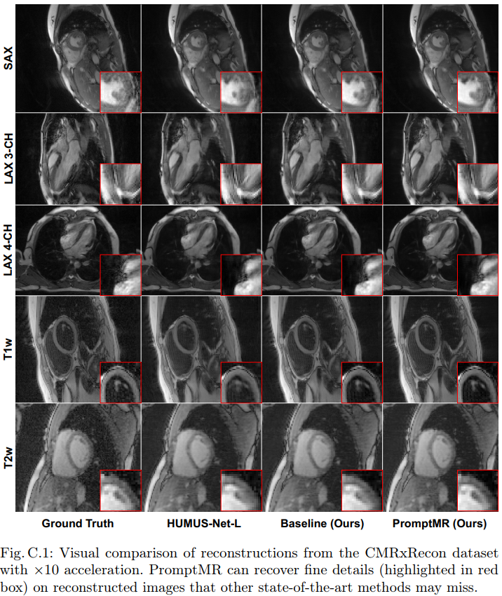

# Fill the K-Space and Refine the Image: Prompting for Dynamic and Multi-Contrast MRI Reconstruction

> The key to dynamic or multi-contrast magnetic resonance
imaging (MRI) reconstruction lies in exploring inter-frame or intercontrast information. Currently, the unrolled model, an approach combining iterative MRI reconstruction steps with learnable neural network layers, stands as the best-performing method for MRI reconstruction.
However, there are two main limitations to overcome: firstly, the unrolled
model structure and GPU memory constraints restrict the capacity of
each denoising block in the network, impeding the effective extraction of
detailed features for reconstruction; secondly, the existing model lacks the
flexibility to adapt to variations in the input, such as different contrasts,
resolutions or views, necessitating the training of separate models for each
input type, which is inefficient and may lead to insufficient reconstruction.
In this paper, we propose a two-stage MRI reconstruction pipeline to address these limitations. The first stage involves filling the missing k-space
data, which we approach as a physics-based reconstruction problem. We
first propose a simple yet efficient baseline model, which utilizes adjacent
frames/contrasts and channel attention to capture the inherent interframe/-contrast correlation. Then, we extend the baseline model to a
prompt-based learning approach, PromptMR, for all-in-one MRI reconstruction from different views, contrasts, adjacent types, and acceleration
factors. The second stage is to refine the reconstruction from the first stage,
which we treat as a general video restoration problem to further fuse features from neighboring frames/contrasts in the image domain. Extensive
experiments show that our proposed method significantly outperforms
previous state-of-the-art accelerated MRI reconstruction methods


Codes and pretrained models on CMRxRecon and fastMRI multi-coil knee dataset to be released after STACOM workshop@MICCAI 2023

## Method


> Overview of **PromptMR** in Stage I: an all-in-one unrolled model for MRI
reconstruction. Adjacent inputs, depicted in image domain for visual clarity,
provide neighboring k-space information for reconstruction. To accommodate
different input varieties, the input-type adaptive visual prompt is integrated into
each cascade of the unrolled architecture to guide the reconstruction process.


> Overview of the **PromptUnet** architecture in PromptMR, featuring a
3-level encoder-decoder design. Each level comprises a DownBlock, UpBlock and
PromptBlock. The PromptBlock in the $i$-th level encodes input-specific context
into fixed prompt $P_i$, producing adaptively learned prompt $\hat{P}_i$. These prompts,
across multiple levels, integrate with decoder features $F_{d,i}$ in the UpBlocks to
allow rich hierarchical context learning.

## Quantitative Results


> Quantitative results on CMRxRecon dataset. 


> Quantitative results on fastMRI multi-coil knee dataset. 

## Qualitative Results





<!-- ## License
This work is licensed under MIT License. See [LICENSE](LICENSE) for details.

If you find our code/models useful, please consider citing our paper:
```
@inproceedings{Xin2020Multi,
  author = {Xin, Bingyu and Hu, Yifan and Zheng, Yefeng and Liao, Hongen},
  title = {Multi-Modality Generative Adversarial Networks With Tumor Consistency Loss for Brain MR Image Synthesis},
  booktitle = {The IEEE International Symposium on Biomedical Imaging (ISBI)},
  year = {2020}
}
``` -->

