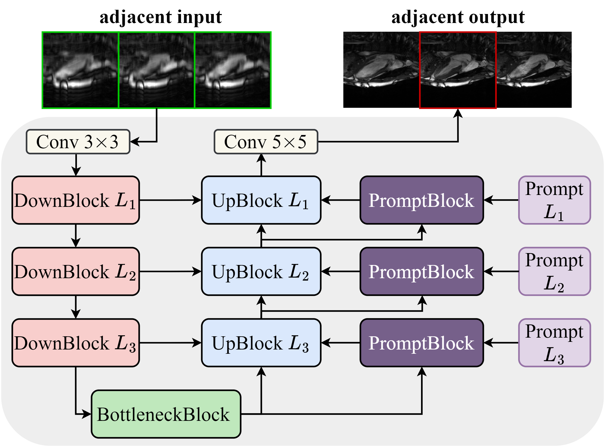

# PromptMR

This repository contains the pytorch implementation of PromptMR, an unrolled model for multi-coil MRI reconstruction. See our paper [Fill the K-Space and Refine the Image: Prompting for Dynamic and Multi-Contrast MRI
Reconstruction](https://arxiv.org/abs/2309.13839) for more details.

[](https://arxiv.org/abs/2309.13839)
[](https://paperswithcode.com/sota/mri-reconstruction-on-fastmri-knee-val-8x?p=fill-the-k-space-and-refine-the-image)


## Updates

- [2024/01/04] 📃 We provide the [additional PromptMR evaluation results](additional_results.md) on the [calgary-campinas](https://sites.google.com/view/calgary-campinas-dataset/mr-reconstruction-challenge?authuser=0) and [fastMRI Multi-coil Brain](https://fastmri.med.nyu.edu/) dataset. Pretrained models and code will be released in the future.

- [2023/10/15] 🔥 We have released training and inference code, along with pretrained PromptMR models, for both the [CMRxRecon](./promptmr_examples/cmrxrecon/README.md) and [fastMRI multi-coil knee](./promptmr_examples/fastmri/README.md) datasets.

- [2023/10/12] 🥇 We secured 1st place in both the Cine and T1/T2 Mapping tasks for cardiac MR reconstruction in the [CMRxRecon Challenge](https://cmrxrecon.github.io/) during MICCAI 2023! [[Final ranking]](https://www.synapse.org/#!Synapse:syn51471091/wiki/624102)

## Method

Overview of PromptMR: an all-in-one unrolled model for MRI reconstruction. Adjacent inputs, depicted in image domain for visual clarity, provide neighboring k-space information for reconstruction. To accommodate different input varieties, the input-type adaptive visual prompt is integrated into each cascade of the unrolled architecture to guide the reconstruction process.

<div align="center">
    
</div>

Overview of the PromptUnet: the denoiser in each cascade of PromptMR. The PromptBlocks can generate adaptively learned prompts across multiple levels, which integrate with decoder features in the UpBlocks to allow rich hierachical context learning.

<div align="center">
    
</div>


## Installation and Data Preparation

See [INSTALL.md](INSTALL.md) for installation instructions and data preparation required to run this codebase.

## Training/Inference Codes & Pretrained models

[CMRxRecon dataset](promptmr_examples/cmrxrecon)

[FastMRI multi-coil knee dataset](promptmr_examples/fastmri)


## Citation
If you found this repository useful to you, please consider giving a star ⭐️ and citing our paper:
```bibtex
@article{xin2023fill,
  title={Fill the K-Space and Refine the Image: Prompting for Dynamic and Multi-Contrast MRI Reconstruction},
  author={Xin, Bingyu and Ye, Meng and Axel, Leon and Metaxas, Dimitris N},
  journal={arXiv preprint arXiv:2309.13839},
  year={2023}
}
```

## Acknowledgements
[E2E-VarNet](https://github.com/facebookresearch/fastMRI), [HUMUS-Net](https://github.com/z-fabian/HUMUS-Net), [PromptIR](https://github.com/va1shn9v/PromptIR), [CMRxRecon](https://github.com/CmrxRecon/CMRxRecon)


<details>
<summary>statistics</summary>


</details>
