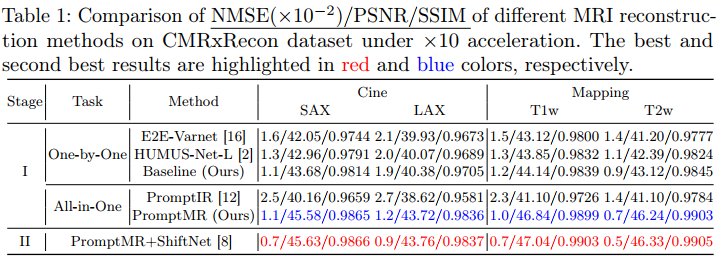

# Reproducing PromptMR results on CMRxRecon dataset

All the following commands should be run under the `promptmr_examples/cmrxrecon` folder. 

## Download the CMRxRecon dataset
Direct download the [CMRxRecon dataset](https://github.com/CmrxRecon/CMRxRecon) from the following links: 

| Platform           | Link                                                                                                  | Password    |
|--------------------|-------------------------------------------------------------------------------------------------------|-------------|
| Baidu Netdisk      | [Link](https://pan.baidu.com/s/1OXSInGc30gkA4RVYqo9Hqw)                                               | b6hj        |
| Google Drive       | [Link](https://drive.google.com/drive/folders/1--8x5GCnx6Cd2p8ATKLS1bvr3Y0ISvNH?usp=sharing)          | N/A         |

## Pretrained models

We provide Google Drive links for downloading our models trained on the CMRxRecon Training Set (120 cases). You can use the respective IDs to retrieve the corresponding performance results of these models on the [Validation Leaderboard](https://www.synapse.org/#!Synapse:syn51471091/wiki/622548). (As of October 31, 2023, `PromptMR-16cascades` delivers the best performance on the Leaderboard.)


| Model              |# of Params     |Download Link                                                                              | Cine Leaderboard ID   | Mapping Leaderboard ID |
|--------------------|----------------|-------------------------------------------------------------------------------------------|-----------------------|------------------------|
| PromptMR-12cascades|82M             |[Link](https://drive.google.com/file/d/1YWMvi1HhC2dC2_hmGJAsfBlOGvZAvYvI/view?usp=sharing) | 9741084               | 9741082                |
| PromptMR-16cascades|108M            |[Link](https://drive.google.com/file/d/1YXB9M9pJ7JY4ld0D3l5a2hAU0UcuyJhN/view?usp=sharing) | 9741143               | 9741142                |

**Note: The leaderboard evaluates only the small central crop area within three slices for each of the 60 validation cases, offering a limited representation of the overall reconstruction results.**

You can also directly use the following command to download the models to the `pretrained_models` folder:

```bash
mkdir pretrained_models
cd pretrained_models
gdown 1YWMvi1HhC2dC2_hmGJAsfBlOGvZAvYvI
gdown 1YXB9M9pJ7JY4ld0D3l5a2hAU0UcuyJhN
```

## Inference

The following commands will reproduce the results of the pretrained PromptMR models on the CMRxRecon Validation Set. Please modify the `input` and `output` to your own path of the downloaded CMRxRecon dataset and the output reconstruction path. `center_crop` is used to crop the central 2 slices, the first 3 time frames(for cine) or all contrasts (for mapping) and the central 1/6 area of the original images following the [submission tutorial](https://www.synapse.org/#!Synapse:syn51471091/wiki/622411), if you want to save the full reconstruction volume, please remove `--center_crop` from the command. `num_cascades` is the number of cascades used in the unrolled model. `task` is to select to inference on which type of data, which can be `Cine` or `Mapping` or `Both`. Please reduce the `batch_size` if you encounter out of GPU memory error.

```bash
## use pretrained promptmr-12cascades model 
CUDA_VISIBLE_DEVICES=1  python run_pretrained_promptmr_cmrxrecon_inference_from_matlab_data.py \
--input /research/cbim/datasets/fastMRI/CMRxRecon/MICCAIChallenge2023/ChallengeData/MultiCoil \
--output /research/cbim/vast/bx64/PycharmProjects/cmr_challenge_results/reproduce_promptmr_12_cascades_cmrxrecon \
--model_path pretrained_models/promptmr-12cascades-epoch=11-step=258576.ckpt \
--evaluate_set ValidationSet \
--task Both \
--batch_size 4 \
--num_works 2 \
--center_crop \
--num_cascades 12

## use pretrained promptmr-16cascades model 
CUDA_VISIBLE_DEVICES=1  python run_pretrained_promptmr_cmrxrecon_inference_from_matlab_data.py \
--input /research/cbim/datasets/fastMRI/CMRxRecon/MICCAIChallenge2023/ChallengeData \
--output /research/cbim/vast/bx64/PycharmProjects/cmr_challenge_results/reproduce_promptmr_16cascades_cmrxrecon \
--model_path pretrained_models/promptmr-16cascades-epoch=11-step=258576.ckpt \
--evaluate_set ValidationSet \
--task Both \
--batch_size 4 \
--num_works 2 \
--center_crop \
--num_cascades 16
```

## Training

### Preprocess the training dataset

For efficient data access during training, it's advisable to convert the original MATLAB data files in TrainingSet to fastMRI-style h5py format. Please modify the `data_path` in the following command to your own path of the downloaded CMRxRecon dataset. The converted h5py files will be saved in the `h5py_folder` folder. After the conversion, the data will be automatically split into 100 training and 20 validation cases.

```bash
python prepare_h5py_dataset_for_training.py \
--data_path /research/cbim/datasets/fastMRI/CMRxRecon/MICCAIChallenge2023/ChallengeData/MultiCoil \
--h5py_folder h5_FullSample
```

<details>
<summary><strong>The h5py files will be saved in the following structure</strong> (click to expand) </summary>

```bash
/research/cbim/datasets/fastMRI/CMRxRecon/MICCAIChallenge2023/ChallengeData/MultiCoil
│   ├── Cine
│   │   ├── TrainingSet
│   │   │   ├── FullSample
│   │   │   ├── h5_FullSample
│   │   │   │   ├── train
│   │   │   │   │   ├── P001
│   │   │   │   │   │   ├── cine_lax.h5
│   │   │   │   │   │   ├── cine_sax.h5
│   │   │   │   │   ├── ...
│   │   │   │   │   ├── P100
│   │   │   │   ├── val
│   │   │   │   │   ├── P101
│   │   │   │   │   │   ├── cine_lax.h5
│   │   │   │   │   │   ├── cine_sax.h5
│   │   │   │   │   ├── ...
│   │   │   │   │   ├── P120
│   │   ├── ValidationSet
│   ├── Mapping
│   │   ├── TrainingSet
│   │   │   ├── FullSample
│   │   │   ├── h5_FullSample
│   │   │   │   ├── train
│   │   │   │   │   ├── P001
│   │   │   │   │   │   ├── T1map.h5
│   │   │   │   │   │   ├── T2map.h5
│   │   │   │   │   ├── ...
│   │   │   │   │   ├── P100
│   │   │   │   ├── val
│   │   │   │   │   ├── P101
│   │   │   │   │   │   ├── T1map.h5
│   │   │   │   │   │   ├── T2map.h5
│   │   │   │   │   ├── ...
│   │   │   │   │   ├── P120
│   │   ├── ValidationSet
```

</details>

### Train the model

The following commands will train the PromptMR model on both Cine and Mapping multicoil data. Please modify the `data_path` to your own path of the downloaded CMRxRecon dataset. `h5py_folder` is the folder name of the converted h5py files. `combine_train_val` is used to combine the training (100) and validation (20) cases for training. `mask_type` specifies the type of the mask, which should be `equispaced_fixed` for CMRxRecon dataset (equispaced mask with fixed 24 low frequency lines). `center_numbers` is the number of low frequency lines in the mask. `accelerations` is the list of accelerations used in the training. `num_cascades` is the number of cascades used in the unrolled model. The checkpoints and log files will be saved in `exp_name` folder. `use_checkpoint` is a [technique](https://pytorch.org/docs/stable/checkpoint.html#torch.utils.checkpoint.checkpoint) used to trades compute for memory when you have limited GPU memory.

```bash
## train promptmr-12cascades model
CUDA_VISIBLE_DEVICES=0,1 python train_promptmr_cmrxrecon.py \
--center_numbers 24 \
--accelerations 4 8 10 \
--challenge multicoil \
--mask_type equispaced_fixed \
--data_path /research/cbim/datasets/fastMRI/CMRxRecon/MICCAIChallenge2023/ChallengeData/MultiCoil \
--h5py_folder h5_FullSample \
--combine_train_val True \
--exp_name promptmr_trainval \
--num_cascades 12 \
--use_checkpoint

## train promptmr-16cascades model
CUDA_VISIBLE_DEVICES=0,1 python train_promptmr_cmrxrecon.py \
--center_numbers 24 \
--accelerations 4 8 10 \
--challenge multicoil \
--mask_type equispaced_fixed \
--data_path /research/cbim/datasets/fastMRI/CMRxRecon/MICCAIChallenge2023/ChallengeData/MultiCoil \
--h5py_folder h5_FullSample \
--combine_train_val True \
--exp_name promptmr_16_cascades_trainval \
--num_cascades 16 \
--use_checkpoint
```

## Paper Results

Results reported in the [paper](https://arxiv.org/abs/2309.13839), which trained on 100 training cases and evaluated on 20 validation cases.

<details>
<summary><strong>Quantitative Results</strong> (click to expand) </summary>



</details>

<details>
<summary><strong>Qualitative Results</strong> (click to expand) </summary>


</details>
