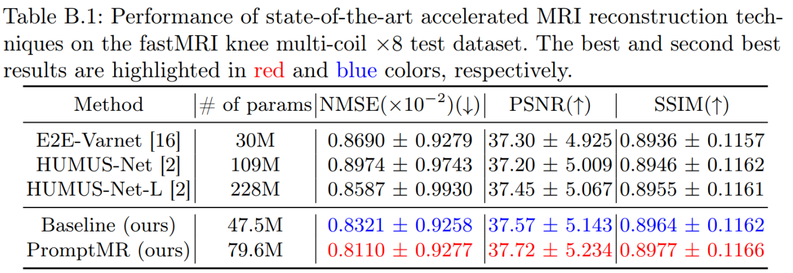

# Reproducing PromptMR results on fastMRI MultiCoil Knee dataset

All the following commands should be run under the `promptmr_examples/fastmri` folder.

## Download the fastMRI MultiCoil Knee dataset

Download knee `multicoil_train` and `multicoil_val` set from fastMRI website: https://fastmri.med.nyu.edu/.

## Split the `multicoil_val` dataset

Since online evaluation platform for original `multicoil_test` set is no longer available ([see here](
https://github.com/facebookresearch/fastMRI/discussions/293)), we can run the following command to automatically split original 199 cases in `multicoil_val` set into 99 validation cases and 100 test cases. Before running, please first rename the original `multicoil_val` folder to `multicoil_val_origin`. (rename `multicoil_test` folder to `multicoil_test_origin` if you already downloaded the `multicoil_test`). Then, download the sampling mask files (fastMRI `random` type sampling mask, 46 files acc=4, 54 files acc=8) I used for 100 splited test cases from [here](https://drive.google.com/file/d/1YY6fifXo5SNFLAhO5M6V9abmVgXs7NvJ/view?usp=sharing). Finally, run the following command will automatically generate our splited `multicoil_val` and `multicoil_test` folders. Please modify the `data_path` and `mask_path` to your own path of the dataset and the sampling mask files.

```bash
python split_val_test.py \
--data_path /research/cbim/datasets/fastMRI/knee_multicoil/multicoil_val_origin \
--mask_path /research/cbim/datasets/fastMRI/knee_multicoil/multicoil_test_mask
```

## Pretrained models
We provide Google Drive links for downloading our models trained on the fastMRI MultiCoil Knee Training Set with `x8` acceleration.


| Model              |# of Params     |Download Link                                                                              |
|--------------------|----------------|-------------------------------------------------------------------------------------------|
| PromptMR-12cascades|80M             |[Link](https://drive.google.com/file/d/1YXgrAoa9MqqSf-6GzXGVkk5-MlQ68w_P/view?usp=sharing) |

You can also directly use the following command to download the models to the `pretrained_models` folder:

```bash
mkdir pretrained_models
cd pretrained_models
gdown 1YXgrAoa9MqqSf-6GzXGVkk5-MlQ68w_P
```

## Inference

The following commands will reproduce the results of the pretrained PromptMR models on the fastMRI MultiCoil Knee Test Set. Please modify the `data_path` and `output_path` to your own path of the dataset and the output reconstruction path. `state_dict_file` is the path of the downloaded pretrained model.

```bash
CUDA_VISIBLE_DEVICES=0 python run_pretrained_promptmr_fastmri_knee_inference.py --challenge varnet_knee_mc \
--state_dict_file pretrained_models/promptmr-12cascades-epoch=35-step=625356.ckpt \
--data_path /research/cbim/datasets/fastMRI/knee_multicoil/multicoil_test \
--output_path /research/cbim/vast/bx64/PycharmProjects/fastmri_results/reproduce_promptmr_knee
```

## Evaluate

The following commands will evaluate the results of the pretrained PromptMR models on the fastMRI MultiCoil Knee `x8` Test Set. Please modify the `target-path`, `predictions-path` and `test-path` to your own path correspondingly. `acceleration` filters the test cases with the specific acceleration factor.

```bash
python evaluate.py \
--target-path /research/cbim/datasets/fastMRI/knee_multicoil/multicoil_test_full \
--predictions-path /research/cbim/vast/bx64/PycharmProjects/fastmri_results/reproduce_promptmr_knee/reconstructions \
--test-path /research/cbim/datasets/fastMRI/knee_multicoil/multicoil_test \
--challenge multicoil \
--acceleration 8 
```

## Training

The following commands will train the PromptMR model on the fastMRI MultiCoil Knee Training Set with `x8` acceleration. Please modify the `data_path` to your own path of the dataset. `center_fractions` specifies the low frequency fractions and the `accelerations` specifies sampling rate of the sampling mask. `mask_type` is the type of the sampling mask (for fastMRI knee dataset, we use `random` type). `no_use_ca` is to disable the usage of channel attention . The checkpoints and log files will be saved in `exp_name` folder. `use_checkpoint` is a [technique](https://pytorch.org/docs/stable/checkpoint.html#torch.utils.checkpoint.checkpoint) used to trades compute for memory when you have limited GPU memory.

```bash
CUDA_VISIBLE_DEVICES=0,1 python train_promptmr_fastmri.py \
--challenge multicoil \
--center_fractions 0.04 \
--accelerations 8 \
--mask_type random \
--data_path /research/cbim/datasets/fastMRI/knee_multicoil \
--combine_train_val False \
--exp_name promptmr_train \
--no_use_ca \
--use_checkpoint
```

## Results 

<details>
<summary><strong>Qualitative Results</strong> (click to expand) </summary>



</details>